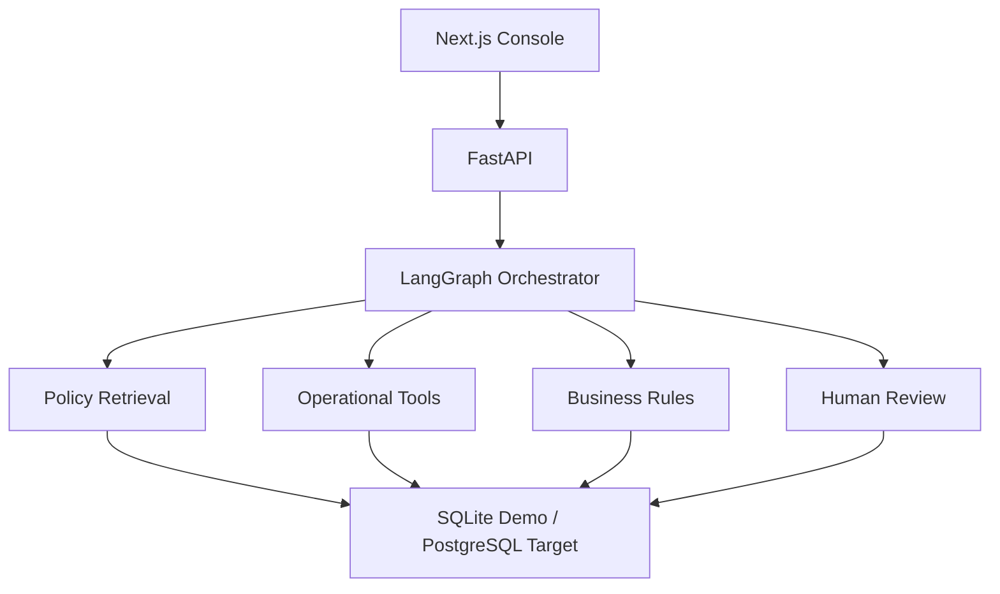

# SupportOps AI

SupportOps AI is a production-minded customer-support agent for the fictional e-commerce company **NovaCart**. It does more than answer questions: it retrieves versioned policies, verifies customer and order state, calls typed operational tools, executes low-risk actions, and hands unsafe cases to a human.

The portfolio claim is narrow and testable: **LLMs can participate in support workflows without owning financial authorization.**

## What works

- 800 synthetic customers and 3,200 linked orders, shipments, and payments
- seven versioned policy documents with attributable retrieval evidence
- explicit LangGraph state across intent, identity, retrieval, operations, authorization, and response
- ten typed tools backed by database reads and transactional writes
- deterministic refund eligibility, calculation, threshold, fraud, and duplicate checks
- idempotent refund execution
- prompt-injection blocking and sanitized trace output
- structured human handoff for unsafe or unresolved cases
- FastAPI endpoints and persisted run observability
- responsive Next.js operations console
- 160-case executable benchmark and evaluation dashboard
- pytest, Docker, and GitHub Actions

## Why an agent is justified

A status lookup needs one operational read. A lost-package refund needs a sequence: identify the customer, validate ownership, inspect tracking, retrieve the lost-package and refund policies, classify the shipment, calculate the amount, pass authorization, mutate payment state, and explain the result. That branching, stateful workflow justifies orchestration. A single prompt does not.

## Architecture



See [docs/architecture.md](docs/architecture.md) for state and trust boundaries.

## Flagship workflow

> “My package ORD-30991 hasn't arrived. Check what happened and refund it if it's considered lost.”

The system calls `get_customer`, `get_order`, `get_shipment`, retrieves `POL-LST-020` and `POL-REF-042`, calls `check_refund_eligibility`, calculates the exact amount, passes the deterministic gate, and calls `issue_refund`. The UI shows each observable event and the cited policies.

## Safety model

Automatic refunds require all conditions below:

```text
verified customer
AND owned order exists
AND policy eligible
AND no processed refund
AND exact calculated amount
AND amount <= $250
AND no fraud flag
```

`issue_refund` enforces the rule again inside a transaction. The model cannot create authorization. High-value and fraud-flagged requests produce a case with customer, order, reason, evidence, attempted actions, and a recommended next step. Retrieved documents are treated as untrusted evidence and cannot redefine tool behavior.

## RAG

Policies are chunk-sized documents with `document_id`, title, version, category, and effective date. The default retriever creates normalized lexical vectors and uses cosine similarity plus a category prior. This keeps local evaluation deterministic and inspectable. The `PolicyEvidence` contract is designed for a pgvector-backed embedding retriever in production; that adapter is intentionally listed as a limitation rather than claimed as implemented.

An optional OpenAI structured-output classifier activates when `OPENAI_API_KEY` is set. Its output is Pydantic-validated, and failures fall back to deterministic routing. It may classify intent; it never authorizes or executes an action.

## Tools

`get_customer` · `get_customer_orders` · `get_order` · `get_shipment` · `check_refund_eligibility` · `calculate_refund` · `issue_refund` · `cancel_order` · `create_support_ticket` · `escalate_to_human`

Every tool validates arguments, returns a `ToolResult`, and maps failures to safe error codes. Financial writes are transactional and idempotent.

## Actual benchmark results

Generated by `python -m evals.run` on 6 September 2026:

| Metric | Achieved |
| --- | ---: |
| Cases executed | 160 |
| Task success | 100% |
| Intent accuracy | 100% |
| Tool selection accuracy | 100% |
| Tool argument accuracy | 100% |
| Retrieval Recall@3 | 100% |
| Citation accuracy | 100% |
| Groundedness | 100% |
| Hallucination rate | 0% |
| Escalation accuracy | 100% |
| P50 / P95 latency | 2.55 / 3.53 ms |
| Estimated model cost per case | $0.000000 |

These are real execution results, not product analytics. Each case runs against an isolated freshly seeded database. The suite is deliberately synthetic and aligned with the implemented operating envelope, so 100% is **not evidence of production generalization**. Latency excludes network LLM calls because the committed benchmark uses deterministic orchestration; token counts are estimates based on request/response length and configured model cost is zero. Per-case outputs live in `backend/data/evaluation-results.json`.

Coverage includes policy questions, order status, damaged-item refunds, returns, cancellations, lost deliveries, high-value and fraud escalation, ambiguity, injected tool failures, and prompt injection.

## Run locally

Requirements: Python 3.12+, Node.js 22+, `uv`, and npm.

```bash
make install
make seed
make api
```

In another terminal:

```bash
make web
```

Open `http://localhost:3000`. API docs are at `http://localhost:8000/docs`.

Or use containers:

```bash
docker compose up --build
```

## Test and evaluate

```bash
make test
make eval
make build
```

`make eval` regenerates the 160-case manifest and evaluation report from actual agent executions. CI runs backend tests, the full benchmark, TypeScript checking, and the Next.js production build.

## API surface

- `GET /health`
- `GET /api/customers/demo`
- `POST /api/agent/run`
- `GET /api/runs/{run_id}`
- `GET /api/evaluations/latest`
- `GET /api/architecture`

Demo requests set `demo_mode=true`, which runs against an isolated real database so repeated portfolio demos do not contaminate one another. Non-demo requests mutate persistent application state.

## Deployment

Deploy `frontend/` to Vercel and set `NEXT_PUBLIC_API_URL` to the public API origin before building. Deploy `backend/` to a container host with persistent storage, set `SUPPORTOPS_DB_PATH`, restrict CORS to the frontend origin, and run the health check. For multi-instance production use, migrate the persistence adapter to PostgreSQL first.

## Limitations

- Synthetic data and benchmark; no real customer traffic or adversarial red-team set
- SQLite and deterministic lexical vectors in the portfolio runtime; PostgreSQL/pgvector is the documented production migration, not a fabricated current capability
- No user authentication, RBAC, carrier/payment-provider credentials, or real refunds
- Optional LLM classification is not exercised by the committed zero-cost benchmark
- Single-process execution; production should add durable queues, tracing export, rate limits, and secret management
- English-only intent routing in V1

NovaCart, its customers, orders, and policies are fictional. No proprietary or personal data is included.
