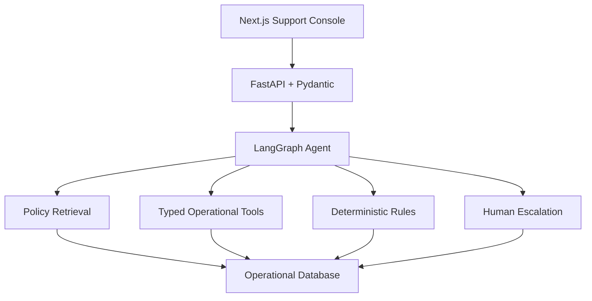
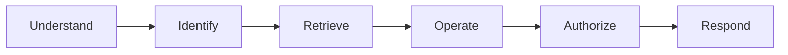

# SupportOps AI Architecture

## Agent state

The graph persists explicit fields for the request, intent and confidence, customer and order context, policy evidence, observable tool events, risk flags, proposed action, authorization, escalation, handoff, and final result. Conversation text is input, not the state store.

## Workflow

The authorization node is code, not a prompt. `issue_refund` independently re-checks policy eligibility, customer verification, fraud state, amount, threshold, prior refunds, and idempotency before mutating the database.

## Trust boundaries

- Customer text and retrieved policy text are untrusted inputs.
- Tool names and arguments are constrained by registered Pydantic schemas.
- Policy retrieval returns attributable evidence; it never grants authorization.
- Financial actions are bounded at $250 by default.
- Trace output contains observable state transitions and sanitized tool I/O, never model chain-of-thought.
- Failed, ambiguous, high-value, fraudulent, or unresolved cases produce a structured human handoff.

## Production path

The local portfolio build uses SQLite for a deterministic, zero-config demo. The tool and retrieval contracts are database-agnostic. A production migration should replace the persistence adapter with PostgreSQL, store embeddings in pgvector, use managed secret storage, add authenticated customer sessions, and use an external queue for long-running actions.
